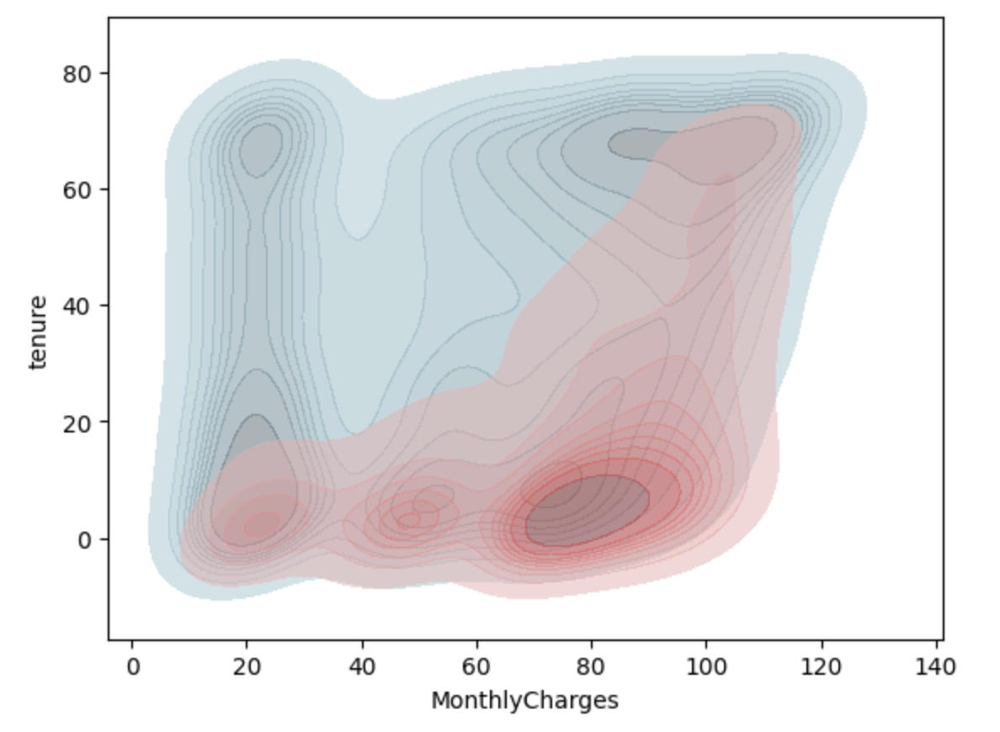
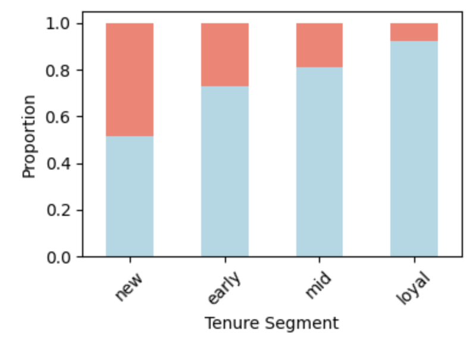
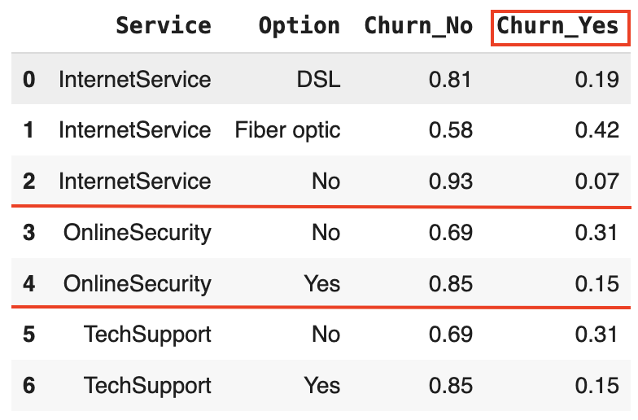
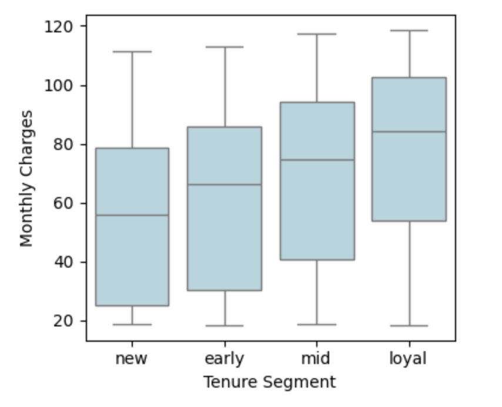
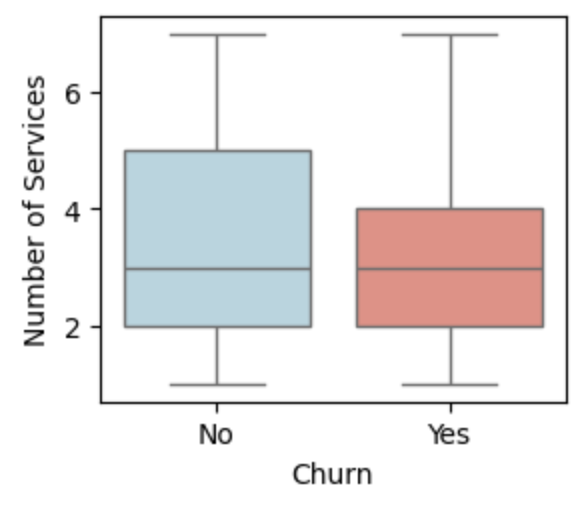
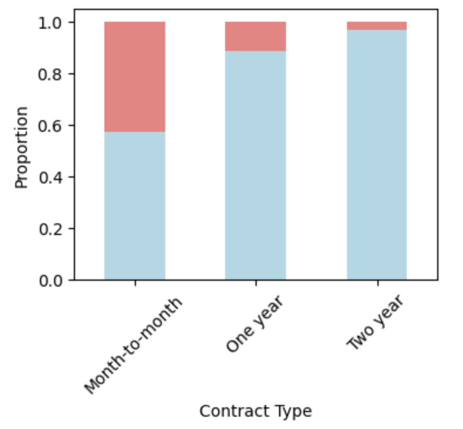
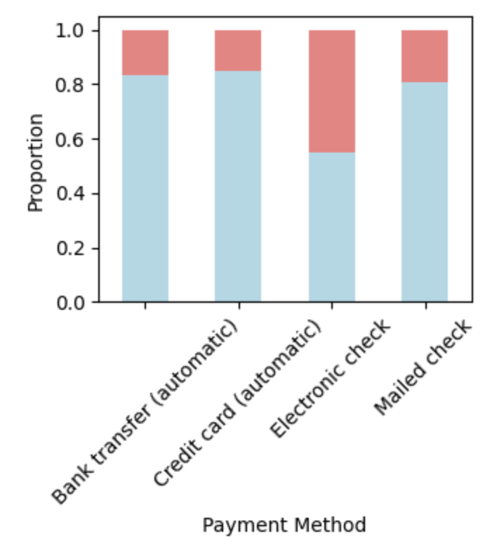
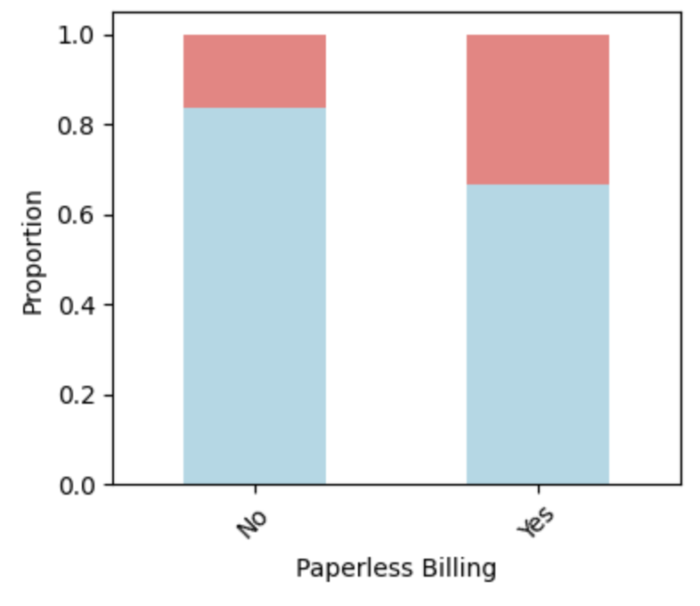
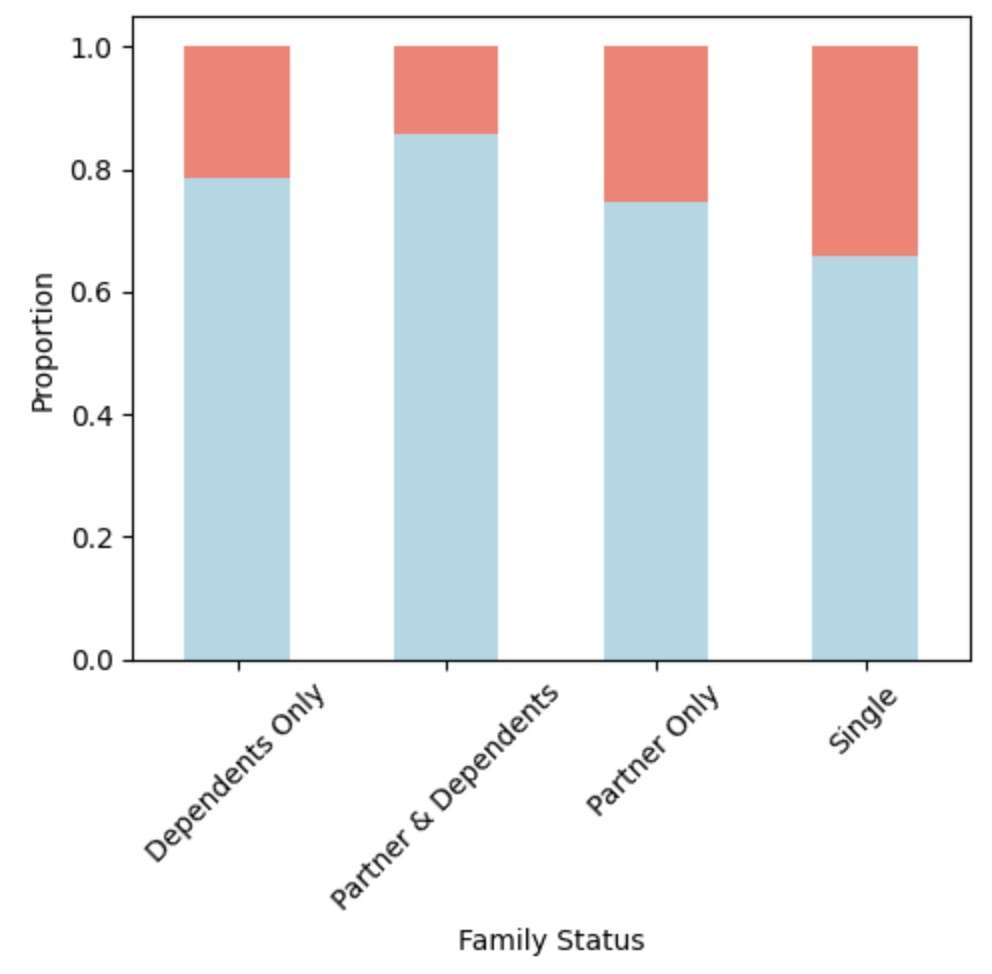

#  Churn Analysis — Who Stays, Who Leaves?

This project analyzes and predicts customer churn in the telecommunications industry—a sector known for high competition and customer turnover. The true cost of churn includes lost revenue as well as marketing and operational costs needed to acquire new customers.

Since acquiring a new customer can cost up to 10× more than retaining an existing one, churn prevention is a critical component of sustainable growth. By analyzing customer demographics, billing behavior, and service usage, this project aims to uncover patterns associated with churn and improve customer retention strategies.

In addition to exploratory data analysis (EDA), the project applies **feature engineering**, **class imbalance handling**, and several **machine learning models** including:
- Logistic Regression
- Decision Trees
- Ensemble Models (Random Forest, Gradient Boosting)
- Stacking Classifiers

###  Dataset Overview

The dataset includes customer-level information across three areas:

1. **Demographics** – gender, senior citizen status, partner, dependents  
2. **Billing Details** – monthly charges, total charges, contract type, payment method  
3. **Service Subscriptions** – internet service, phone service, streaming, tech support  
4. **Tenure** – number of months a customer has been subscribed

👉 A related [SQL-based](https://github.com/kianaseraj/SQL-Data-Analytics-Report/tree/main/churn) churn report is available here .

### Key Questions Explored

A. What customer behaviors are strongly associated with churn?  
B. Do service features like tech support or online backup impact churn likelihood?  
C. Which customer groups pay more?  
D. Is the number of services correlated with retention?  
E. How do contract type, billing, and payment method affect churn?  
F. Do customers with dependents churn less?

### Defining Churn

Churn is defined as customers explicitly leaving the service (as labeled in the dataset). It’s treated as a binary classification problem:  
- **1 = Churned**  
- **0 = Retained**

###  Data Cleaning & Preprocessing

- Removed duplicates, handled missing values and outliers  
- Encoded categorical variables (e.g., One-Hot and Ordinal)  
- Normalized numerical features for consistency

###  Feature Engineering & Selection

- Created features like:
  - `NumServices`: Number of subscribed services
  - `charge_diff`: Expected vs. actual billing discrepancies
- Performed correlation analysis:
  - Pearson for numerical
  - Cramér's V for categorical variables
- Removed low-relevance features to reduce noise

### Class Imbalance Handling

- Churned customers were a minority → **Stratified Sampling**  
- Used **class weights** and **threshold tuning** (e.g., 0.45)  
- Focused on **Recall** as the business-critical metric

###  Exploratory Data Analysis (EDA)

Insights were extracted through visualizations and segment analysis:

> Note: In all graphs, **salmon color = churned customers**, **light blue = retained customers**.

| Observation | Visual |
|-------------|--------|
| Loyal customers churn less despite rising costs |   |
| Lack of tech support / online security doubles churn rate |  |
| Long-tenure customers pay more monthly |  |
| New customers use fewer services |  |
| Paperless billing + month-to-month contracts = high churn |    |
| Customers without dependents churn 2× more |  |

### Predictive Modeling

Trained and compared several classifiers:
- **Logistic Regression** (baseline)
- **Random Forest**
- **Gradient Boosting**
- **SVM**
- **Neural Network**

### Evaluation Metrics

| Model            | Recall | Accuracy | F1-score |
|------------------|--------|----------|----------|
| Neural Network   | 90%    | 75%      | 61%      |
| Random Forest    | 84%    | 73%      | 61%      |
| Gradient Boost.  | 83%    | 73%      | 62%      |
| Logistic Reg.    | 82%    | 73%      | 62%      |
| SVM              | 80%    | 75%      | 63%      |

> **Priority: Recall** — Better to flag loyal customers than miss churners

