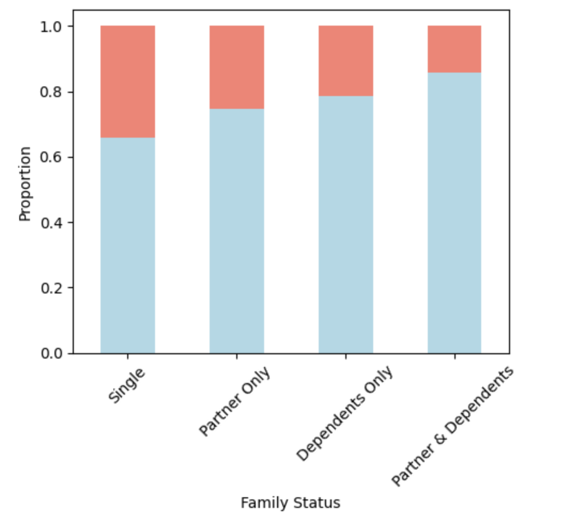

**Churn Analysis – Who Stays, Who Leaves?**

In this study, we analyze and predict customer churn in the telecommunications industry—a sector known for intense competition and high customer turnover. The true cost of churn includes not only the lost revenue from departing customers but also the marketing and operational costs required to acquire new ones. It is well-documented that the cost of acquiring a new customer can be up to 10 times higher than retaining an existing one—making churn prevention a critical component of sustainable growth. Therefore, understanding the behavioral patterns and service usage of customers can provide substantial revenue benefits by improving retention and customer satisfaction.

Churn analysis differs from typical sales or customer analyses in that it is more exploratory in nature. Rather than focusing solely on performance metrics, it seeks to understand why customers leave. It requires a deeper focus on the customer’s point of view and market expectations. By analyzing customer demographics, service subscriptions, and billing behaviors, we aim to uncover patterns that can help predict churn and inform strategies for improving customer loyalty.

In this project, feature selection, transformation, and engineering have been applied. We experimented with several machine learning algorithms including Logistic Regression, Decision Trees, and Ensemble Methods. Ensemble techniques, particularly stacking models, outperformed individual classifiers and delivered the best predictive performance. 

📄 **Dataset Overview**

The dataset includes customer-level information across three key areas:

1. Demographics – such as gender, senior citizen status, and whether the customer has a partner or dependents.
2. Billing Details – including monthly charges, total charges, contract type, and payment method.
3. Subscribed Services – such as internet service, phone service, streaming options, and technical support.

In addition to these features, the dataset provides tenure, which indicates the number of months a customer has remained subscribed to the service.

**🔍 Key Questions We Aim to Answer**

A. What customer behaviors are most strongly associated with churn?

B. Do service features like tech support or online backup impact churn likelihood?

C. Which customer groups overpay compared to expected charges (using charge_diff and tenure segments)?

D. Does the number of subscribed services (NumServices) correlate with retention?

E. What is the impact of billing methods on retention—specifically, contract types and payment methods?

F. Are there noticeable differences in churn rates between customers with and without dependents?

💡 **Defining Churn**

Customer churn refers to the phenomenon of customers discontinuing a service or subscription. In subscription-based industries such as telecommunications, banking, or insurance, churn is typically defined as the act of cancelling a subscription or not renewing within a given time frame. Other forms of disengagement (e.g. long inactivity, negative feedback) may also indicate churn in broader contexts.
In this project, churn is defined based on the customer explicitly leaving the service, as labeled in the dataset.

🧹 **Data Cleaning & Preprocessing**

The raw dataset underwent several essential preprocessing steps:

Handling missing values, outliers, and duplicate records

Encoding categorical variables using appropriate techniques (e.g., one-hot, ordinal)

Normalizing numerical features to ensure scale consistency

🎯 **Feature Selection & Engineering** 

To build a robust predictive model, we performed feature selection to retain the most relevant information:

Demographic variables: e.g., gender, age, and dependent status

Service usage: such as internet service, tech support, streaming services

Billing behavior: including monthly charges and payment method

Engineered features like NumServices and charge_diff were created to capture richer behavioral patterns

We also performed correlation analysis to understand which variables have strong relationships with churn.

⚖️ **Handling Class Imbalance**

Since churned customers form a minority in the dataset, stratified sampling was applied to ensure class balance. For example, sampling was done in a way that the distribution of churn within age or other segments remained proportional across train/test sets.

📊 **Exploratory Data Analysis (EDA)**

Using descriptive statistics and visualizations, we examined:

Relationships between tenure, monthly charges, and churn

The distribution of churn across contract types, services, and payment methods

The behavior of engineered features like charge_diff and NumServices across churn segments

These insights guided our feature engineering and model selection steps.

🤖 **Predictive Modeling**

We trained and compared multiple machine learning models:

.**Logistic Regression** (as a baseline)

.**Decision Trees**

.**Ensemble models** (e.g., Random Forest, Gradient Boosting)

.**Stacking classifiers**, which combine multiple learners for enhanced performance

We also experimented with advanced models like the Cox Proportional Hazards model and deep learning-based classifiers to capture non-linear interactions and time-to-churn patterns.

📈 **Model Evaluation**

Models were evaluated using standard classification metrics:

Accuracy

Precision, Recall, F1-Score

ROC-AUC

Boosting models consistently provided the best performance due to their ability to handle complex patterns and class imbalance. However, when churn rates were low, logistic regression also performed surprisingly well and offered interpretable results.

🧠 **Summary**
By analyzing customer demographics, service usage patterns, and billing behavior, we identified the key predictors of churn. Feature engineering (like charge_diff) and thoughtful model selection significantly improved prediction accuracy.

Our results highlight that:

Ensemble and boosting models (non-parametric) offer superior predictions.

Logistic regression remains a strong baseline when churn rates are low.

Understanding customer behavior through explanatory analysis is critical for improving retention and reducing acquisition costs.

During predictoin it is tried to continuesly improve the model architecture and remove the features with low correlation values.

By analysing the services customers use their characteristics and billing information we try to predict which customers are prone to churn. 

The result shows that boosting techniques, which are non-paramteric, provide superior estimates. Also when the custoemr churn ate is lower it shows that logistic regression can be useful. In cases where churn is less, logistic rregressiion can be a good choice.

A. What customer behaviors are most associated with churn?

B. Do service features like tech support or online backup impact churn?

C. Which customer groups pay more?

D. Does the number of subscribed services (NumServices) correlate with retention?

E. What is the impact of billing methods on retention, contract type and payment methods

F. Are there differences in churn rates between customers with and without dependents?

A.

  
  

B. 

  
  

C.

  
  

D.

  

E. 

  
  
  

F. 

  

